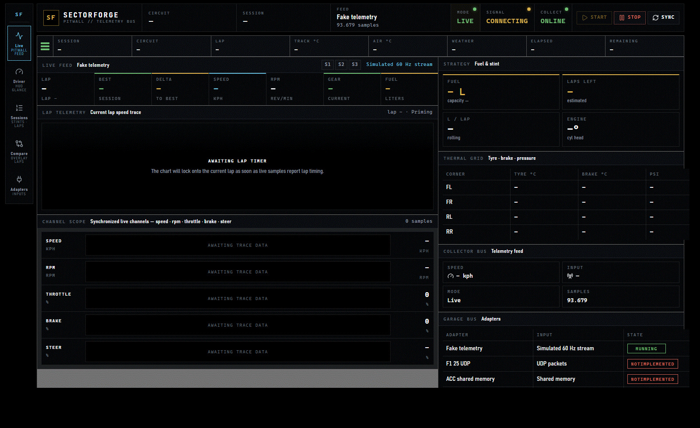
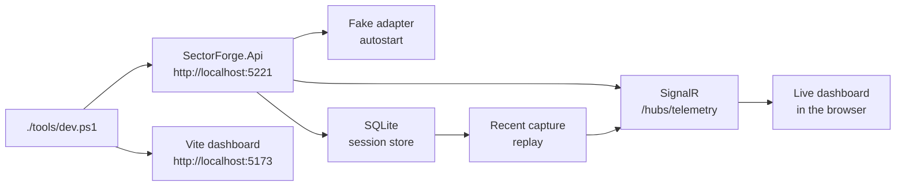
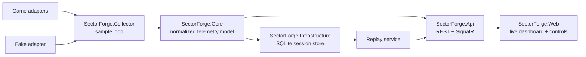
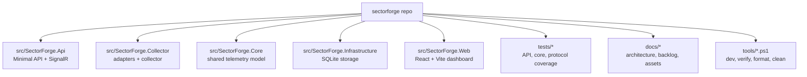

# SectorForge

[](https://github.com/TheAnarchoX/sectorforge/actions/workflows/ci.yml)
[](tests/coverage/README.md)
[](LICENSE)


SectorForge is a Windows-first, local-first telemetry and race analysis app for sim racing. The current slice pairs a native .NET collector and local API with SignalR live telemetry, SQLite session storage, replay controls, a React/Vite dashboard, and a config-gated F1 25 UDP beta path.

Docker, WSL, admin rights, and a running sim are not required for the current MVP. The fake adapter starts automatically through the normal dev script so contributors can work on the runtime, storage, and UI without needing real game telemetry. F1 25 UDP can be enabled manually when the game is configured to send telemetry to SectorForge.

## Quick Look

- Native collector and adapter boundary for fake, UDP, shared memory, plugin, or replay inputs.
- Config-gated F1 25 UDP beta adapter with player-car telemetry and optional session, tyre, ERS, damage, weather, and participant timing channels.
- Normalized telemetry model in the backend so live, stored, and replay flows share the same data shape.
- Local SignalR dashboard with live feed, session review, replay, lap compare, and driving-focused views.
- SQLite persistence with bounded raw sample retention for long local runs.




## Setup

### Prerequisites

- Windows 11 or Windows 10
- .NET SDK 10.0.203 or newer 10.0 feature release
- Node.js 24 or current LTS
- `npx` from npm
- Optional: global `pnpm`; scripts fall back to `npx pnpm@latest`

### Local Development

1. Clone the repo and open it in PowerShell.

   ```powershell
   git clone https://github.com/TheAnarchoX/sectorforge.git
   Set-Location .\sectorforge
   ```

2. Start the local API and dashboard.

   ```powershell
   .\tools\dev.ps1
   ```

   `tools\dev.ps1` installs frontend dependencies automatically when `src\SectorForge.Web\node_modules` is missing. Pass `-NoInstall` if dependencies are already present and you want to skip that check.

3. Open `http://localhost:5173`. The API listens on `http://localhost:5221` and autostarts the fake telemetry adapter.

4. If either default port is occupied, rerun with explicit ports.

   ```powershell
   .\tools\dev.ps1 -ApiPort 5222 -WebPort 5174
   ```

5. Before opening a pull request, run the local quality gate.

   ```powershell
   .\tools\verify.ps1
   ```

Useful local commands:

```powershell
.\tools\verify.ps1
.\tests\coverage\Invoke-Coverage.ps1
npx --yes pnpm@10.33.2 --dir .\src\SectorForge.Web test:coverage
dotnet test .\src\SectorForge.slnx
.\tools\format.ps1
.\tools\clean.ps1
.\tools\clean.ps1 -Full
```

`tools\verify.ps1` runs the full local quality gate: backend tests, .NET format verification, frontend lint, and frontend build. `tests\coverage\Invoke-Coverage.ps1` generates merged Cobertura and HTML coverage reports under `artifacts\coverage\report` and enforces the backend thresholds from `tests\coverage\coverage-thresholds.json`. The frontend coverage command writes HTML/Cobertura output to `artifacts\coverage\frontend` and enforces the 90% frontend line gate. The current frontend baseline is 92.31% line coverage.

### Common Settings

The API host reads its runtime configuration from `src\SectorForge.Api\appsettings.json` (and the matching `appsettings.Development.json`). All values can be overridden with environment variables (e.g. `Adapters__fake__SampleRateHz=30`) or `--Section:Key=value` command-line flags.

| Setting | Default | Purpose |
| --- | --- | --- |
| `Collector:AutoStart` | `false` | Start the collector automatically with `Collector:AdapterId` when the API host boots. |
| `Collector:AdapterId` | `fake` | Adapter id selected when autostart is enabled. |
| `Storage:RetainedSampleBlobLimit` | `1800` | Per-session raw sample blob cap; older blobs are pruned, summaries are kept. |
| `Adapters:<id>:Enabled` | `true` for `fake`, `false` for real-game adapters | Enable flag per adapter id (e.g. `fake`, `f1-25-udp`, `acc-shared-memory`, `ams2-project-cars`, `lmu-plugin-udp`). |
| `Adapters:fake:SampleRateHz` | `60` | Fake adapter emit rate in Hertz. |
| `Adapters:<id>:BindAddress` | `127.0.0.1` for UDP adapters | UDP/socket bind address for adapters that bind a listener. |
| `Adapters:<id>:Port` | adapter-specific (e.g. `20777` for `f1-25-udp`) | UDP/socket port for adapters that bind a listener. |
| `Adapters:<id>:ReceiveBufferBytes` | OS default | Optional UDP socket receive buffer override. |

### F1 25 UDP Beta

The `f1-25-udp` adapter is implemented but opt-in. It listens for F1 25 UDP packets, publishes normalized player-car samples, and fills optional channel groups when their source packets have arrived: motion and g-force data, lap timing, sector splits, driver flags, tyres, ERS, damage, weather forecast, safety-car/session status, and participant timing.

The adapter stays disabled by default so local development remains game-free. Missing optional packets leave their `TelemetrySample` fields `null`, unsupported packet IDs are skipped, and bind or parse failures surface through collector status instead of crashing the API host. Team and car display names are still generic because the normalized model does not carry F1-specific IDs yet.

For a manual F1 25 run, start the API with the F1 adapter selected and start the dashboard in a second PowerShell window:

```powershell
$env:ASPNETCORE_URLS = "http://localhost:5221"
$env:ASPNETCORE_ENVIRONMENT = "Development"
dotnet run --project .\src\SectorForge.Api\SectorForge.Api.csproj --no-launch-profile -- `
   --Collector:AutoStart=true `
   --Collector:AdapterId=f1-25-udp `
   --Adapters:f1-25-udp:Enabled=true `
   --Adapters:f1-25-udp:BindAddress=0.0.0.0 `
   --Adapters:f1-25-udp:Port=20777
```

```powershell
$env:VITE_API_BASE_URL = "http://localhost:5221"
npx --yes pnpm@latest --dir .\src\SectorForge.Web dev --host localhost --port 5173
```

Configure F1 25 to send UDP telemetry to the machine and port SectorForge is listening on. Use `127.0.0.1` if the game and API are on the same machine; use a LAN address or `0.0.0.0` bind when receiving from another host.

### Local Development Loop



## Architecture Overview



The backend is the source of truth. The web UI renders state, controls the local collector, and reuses the same live publish path for replay. Game-specific parsing stays isolated inside collector adapters so packet or shared-memory layouts do not leak into the normalized model.

- `SectorForge.Core` owns the game-agnostic records, enums, and interfaces.
- `SectorForge.Collector` owns adapters, the collector loop, and fake telemetry for local development.
- `SectorForge.Api` exposes the local control plane, SignalR stream, and replay endpoints.
- `SectorForge.Infrastructure` persists sessions, lap summaries, and retained sample blobs.
- `SectorForge.Web` renders live telemetry, stored sessions, replay state, and the driver-facing views.

For the deeper runtime breakdown, see [docs/architecture.md](docs/architecture.md) and [docs/game-adapters.md](docs/game-adapters.md).

## Current Slice

| Area | Status |
| --- | --- |
| Fake telemetry adapter | Working 60 Hz simulated stream |
| ASP.NET Core API | Health, games, sessions, collector control, replay control |
| SignalR hub | Streams normalized telemetry samples |
| React dashboard | Live feed, session review, replay controls, driver HUD, F1 25 optional channel panels |
| SQLite storage | Sessions, lap summaries, raw sample blobs with retention cap |
| Compare workflow | Usable lap basket, overlay chart, delta plot, sector table, and synchronized cursor |
| F1 25 UDP | Beta, config-gated; player-car telemetry plus optional packet aggregation |
| ACC shared memory | Placeholder adapter |
| AMS2 telemetry | Placeholder adapter |
| LMU plugin/UDP | Placeholder adapter |

The GitHub Actions workflow runs on Windows and checks merged .NET coverage thresholds, frontend Vitest coverage, .NET format verification, frontend lint, and frontend build. The coverage badge above reflects the current documented 94.13% overall line-coverage baseline from [tests/coverage/README.md](tests/coverage/README.md).

## Repository Map



## More Docs

- [CONTRIBUTING.md](CONTRIBUTING.md) for local checks and contribution rules.
- [docs/architecture.md](docs/architecture.md) for runtime flow, storage, frontend guardrails, and the [compare workflow](docs/architecture.md#compare-workflow).
- [docs/game-adapters.md](docs/game-adapters.md) for adapter status, enablement notes, and limitations.
- [docs/protocol-notes.md](docs/protocol-notes.md) for protocol references and implementation decisions.
- [docs/agent-tasks.md](docs/agent-tasks.md) for the scoped backlog.
- [AGENTS.md](AGENTS.md) for repo-level coding-agent guidance.
- [tests/coverage/README.md](tests/coverage/README.md) for baseline and threshold details.

## License

SectorForge is licensed under the SectorForge Non-Commercial License. You may
use, fork, modify, and share the software and derivative works for
non-commercial purposes. You may not sell the software, sell forks or derivative
works, or otherwise use them to generate revenue. See [LICENSE](LICENSE).

Because this license restricts commercial use, SectorForge is source-available
rather than OSI-approved open source.
