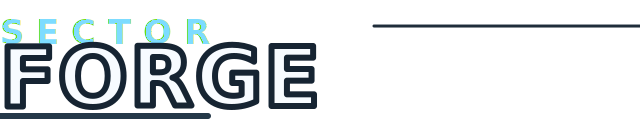
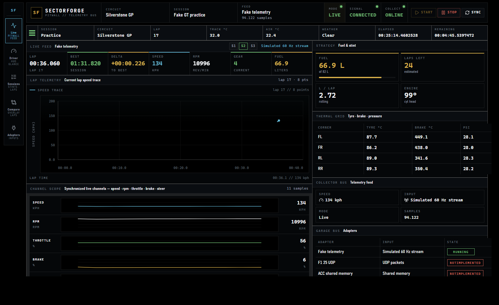
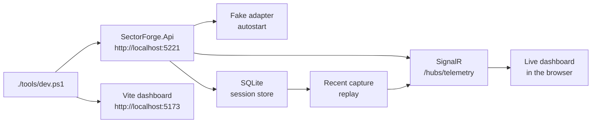
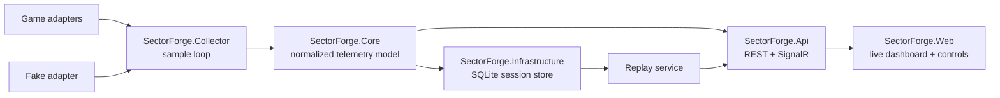
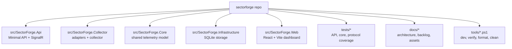

# SectorForge

[](https://github.com/TheAnarchoX/sectorforge/actions/workflows/ci.yml)
[](tests/coverage/README.md)
[](LICENSE)



SectorForge is a Windows-first, local-first telemetry and race analysis app for sim racing. The current slice pairs a native .NET collector and local API with SignalR live telemetry, SQLite session storage, replay controls, and a React/Vite dashboard.

Docker, WSL, admin rights, and a running sim are not required for the current MVP. The fake adapter starts automatically so contributors can work on the runtime, storage, and UI without needing real game telemetry.

## Quick Look

- Native collector and adapter boundary for UDP, shared memory, plugin, or replay inputs.
- Normalized telemetry model in the backend so live, stored, and replay flows share the same data shape.
- Local SignalR dashboard with live feed, session review, replay, and driving-focused views.
- SQLite persistence with bounded raw sample retention for long local runs.



## Setup

### Prerequisites

- Windows 11 or Windows 10
- .NET SDK 10.0.203 or newer 10.0 feature release
- Node.js 24 or current LTS
- `npx` from npm
- Optional: global `pnpm`; scripts fall back to `npx pnpm@latest`

### Local Development

1. Clone the repo and open it in PowerShell.

   ```powershell
   git clone https://github.com/TheAnarchoX/sectorforge.git
   Set-Location .\sectorforge
   ```

2. Start the local API and dashboard.

   ```powershell
   .\tools\dev.ps1
   ```

   `tools\dev.ps1` installs frontend dependencies automatically when `src\SectorForge.Web\node_modules` is missing. Pass `-NoInstall` if dependencies are already present and you want to skip that check.

3. Open `http://localhost:5173`. The API listens on `http://localhost:5221` and autostarts the fake telemetry adapter.

4. If either default port is occupied, rerun with explicit ports.

   ```powershell
   .\tools\dev.ps1 -ApiPort 5222 -WebPort 5174
   ```

5. Before opening a pull request, run the local quality gate.

   ```powershell
   .\tools\verify.ps1
   ```

Useful local commands:

```powershell
.\tools\verify.ps1
.\tests\coverage\Invoke-Coverage.ps1
npx --yes pnpm@10.33.2 --dir .\src\SectorForge.Web test:coverage
dotnet test .\src\SectorForge.slnx
.\tools\format.ps1
.\tools\clean.ps1
.\tools\clean.ps1 -Full
```

`tools\verify.ps1` runs the full local quality gate: backend tests, .NET format verification, frontend lint, and frontend build. `tests\coverage\Invoke-Coverage.ps1` generates merged Cobertura and HTML coverage reports under `artifacts\coverage\report` and enforces the backend thresholds from `tests\coverage\coverage-thresholds.json`. The frontend coverage command writes HTML/Cobertura output to `artifacts\coverage\frontend` and enforces the 90% frontend line gate. The current frontend baseline is 92.31% line coverage.

### Local Development Loop



## Architecture Overview



The backend is the source of truth. The web UI renders state, controls the local collector, and reuses the same live publish path for replay. Game-specific parsing stays isolated inside collector adapters so packet or shared-memory layouts do not leak into the normalized model.

- `SectorForge.Core` owns the game-agnostic records, enums, and interfaces.
- `SectorForge.Collector` owns adapters, the collector loop, and fake telemetry for local development.
- `SectorForge.Api` exposes the local control plane, SignalR stream, and replay endpoints.
- `SectorForge.Infrastructure` persists sessions, lap summaries, and retained sample blobs.
- `SectorForge.Web` renders live telemetry, stored sessions, replay state, and the driver-facing views.

For the deeper runtime breakdown, see [docs/architecture.md](docs/architecture.md) and [docs/game-adapters.md](docs/game-adapters.md).

## Current Slice

| Area | Status |
| --- | --- |
| Fake telemetry adapter | Working 60 Hz simulated stream |
| ASP.NET Core API | Health, games, sessions, collector control, replay control |
| SignalR hub | Streams normalized telemetry samples |
| React dashboard | Live feed, session review, replay controls, driver HUD |
| SQLite storage | Sessions, lap summaries, raw sample blobs with retention cap |
| Compare workflow | Placeholder workspace for lap overlay work |
| F1 25 UDP | Placeholder adapter |
| ACC shared memory | Placeholder adapter |
| AMS2 telemetry | Placeholder adapter |
| LMU plugin/UDP | Placeholder adapter |

The GitHub Actions workflow runs on Windows and checks merged .NET coverage thresholds, frontend Vitest coverage, .NET format verification, frontend lint, and frontend build. The coverage badge above reflects the current documented 94.13% overall line-coverage baseline from [tests/coverage/README.md](tests/coverage/README.md).

## Repository Map



## More Docs

- [CONTRIBUTING.md](CONTRIBUTING.md) for local checks and contribution rules.
- [docs/architecture.md](docs/architecture.md) for runtime flow, storage, and frontend guardrails.
- [docs/agent-tasks.md](docs/agent-tasks.md) for the scoped backlog.
- [AGENTS.md](AGENTS.md) for repo-level coding-agent guidance.
- [tests/coverage/README.md](tests/coverage/README.md) for baseline and threshold details.

## License

MIT License. See [LICENSE](LICENSE).
